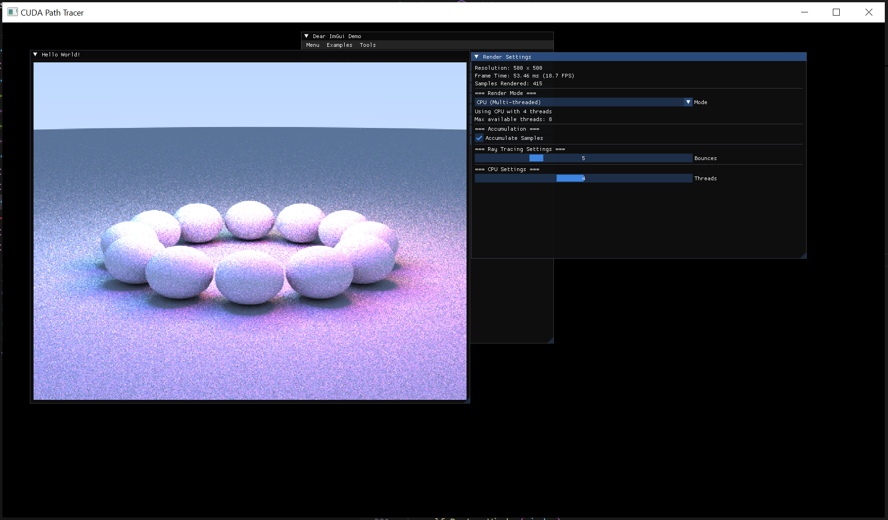
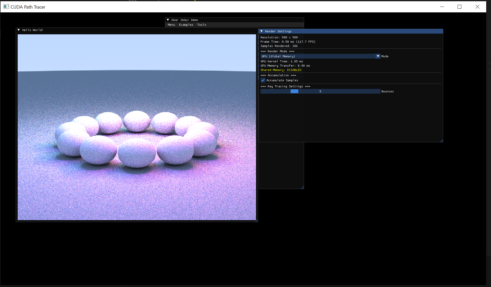
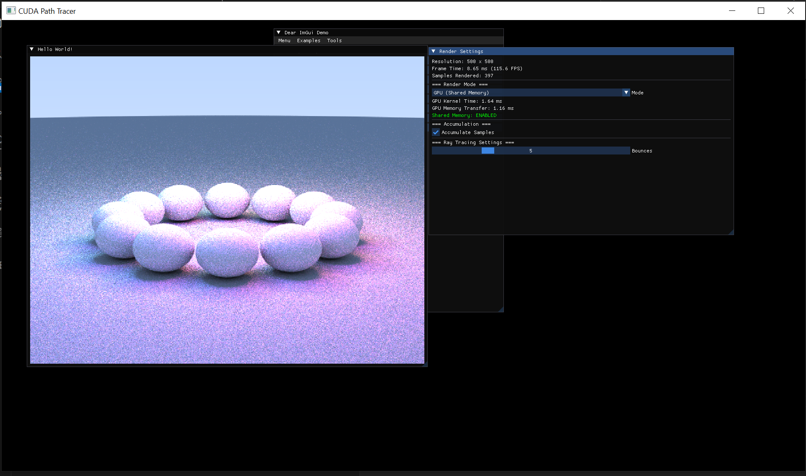

# **CUDA Path Tracing Ray Tracer**

## **1. Repository Structure**

### **CMake Repository (gcc/g++)**

This project is a CMake-based repository that compiles with **gcc/g++** and **nvcc** (CUDA compiler). The build system supports both CPU and GPU implementations.

#### **Organization**

```
final_assignment_2400075/
|-- CMakeLists.txt          # Main CMake configuration
|-- vcpkg.json              # Dependency management
|-- src/                    # Source code directory
|   |-- main.cpp            # Application entry point
|   |-- cpu_raytracer.h     # CPU raytracer header
|   |-- cpu_raytracer.cpp   # CPU multi-threaded implementation
|   |-- gpu_raytracer.cuh   # GPU raytracer header (global memory)
|   |-- gpu_raytracer.cu    # GPU implementation (global memory)
|   |-- gpu_shared_raytracer.cuh  # GPU raytracer header (shared memory)
|   |-- gpu_shared_raytracer.cu   # GPU implementation (shared memory)
|   |-- vec3.h              # 3D vector math utilities
|   |-- utility.h            # Utility functions
|   |-- interval.h           # Interval utilities
|   |-- display.cpp          # OpenGL display functions
|   |-- gui.cpp              # ImGui user interface
|   `-- helloworld.h         # Common headers and declarations
|-- build/                   # Build directory (generated)
`-- README                   # Original documentation
```

#### **Build System**

The project uses **CMake 3.30+** with CUDA support. Key build features:

- **C++20** standard
- **CUDA Toolkit 12.8** integration
- **vcpkg** for dependency management (GLFW, ImGui, GLEW, GLM)
- Cross-platform support (Windows, Linux, macOS)

**Build Commands:**
```bash
# Configure
cmake -S . -B build -DCMAKE_TOOLCHAIN_FILE="$VCPKG_ROOT/scripts/buildsystems/vcpkg.cmake"

# Build
cmake --build build

# Run
./build/helloworld
```

---

## **2. Path Tracing on CUDA**

### **Implementation Location**

The CUDA path tracing implementation is located in the following files:

#### **a) CUDA Grid Implementation for Path Tracing**

**File:** `src/gpu_raytracer.cu` and `src/gpu_raytracer.cuh`

**Key Components:**

- **Kernel Launch:** `gpuPathTracingKernel` (in `gpu_raytracer.cu`)
- **Grid Configuration:** 16x16 thread blocks
- **Thread Mapping:** One thread per pixel
- **Grid Dimensions:**
  ```cuda
  dim3 blockSize(16, 16);
  dim3 gridSize((camera.image_width + blockSize.x - 1) / blockSize.x,
                (camera.image_height + blockSize.y - 1) / blockSize.y);
  ```

**Path Tracing Algorithm:**

- **Ray Generation:** Each thread generates a camera ray for its assigned pixel
- **Ray-Sphere Intersection:** `gpuHitWorld()` and `gpuHitSphere()` functions
- **Material Evaluation:** Albedo, emission, and scattering properties
- **Hemisphere Sampling:** `gpuSampleHemisphere()` for diffuse scattering
- **Path Continuation:** Up to `maxBounces` bounces per ray
- **Sample Accumulation:** Progressive rendering with multiple samples per pixel


#### **b) Shared Memory**

**Details:**
```cuda
// Maximum spheres in shared memory
#define MAX_SHARED_SPHERES 64

// Cooperative loading pattern
int tid = threadIdx.y * blockDim.x + threadIdx.x;
int blockSize = blockDim.x * blockDim.y;
int spheresToLoad = (numSpheres < MAX_SHARED_SPHERES) ? numSpheres : MAX_SHARED_SPHERES;

for (int i = tid; i < spheresToLoad; i += blockSize) {
    sharedSpheres[i] = globalSpheres[i];
}
__syncthreads();
```

**Kernel Launch:**
```cuda
size_t sharedMemSize = spheresToLoad * sizeof(CudaSphere);
gpuSharedPathTracingKernel<<<gridSize, blockSize, sharedMemSize>>>(...);
```

**Summary:** 

```powershell
CPU Raytracer initialized: 500 x 500, 25 spheres
GPU Ray Tracer (Global Memory) initialized:
  Image: 500 x 500
  Spheres: 25

GPU Ray Tracer (Shared Memory) initialized:
  Image: 500 x 500
  Spheres: 25 (max shared: 64)
  Shared memory per block: 1200 bytes

=== CUDA Path Tracer Initialized ===
Resolution: 500 x 500
CPU spheres: 25, GPU spheres: 25
Default mode: GPU (Shared Memory)
```


## **3. Rendered Results**

### **CPU Implementation (Multi-threaded)**



`src/cpu_raytracer.cpp`

### **GPU Global Memory Implementation**



 `src/gpu_raytracer.cu`

### **GPU Shared Memory Implementation**



 `src/gpu_shared_raytracer.cu`
---

## **4. Reporting**

### **Profiling with Nsight**

**Nsight Systems** and **Nsight Compute** should be used to profile the CUDA implementations:

#### **Profiling Commands:**

```bash
# Profile with Nsight Systems (timeline analysis)
nsys profile --output=profile_report ./build/helloworld

# Profile with Nsight Compute (kernel analysis)
ncu --set full --export profile.ncu-rep ./build/helloworld
```

The repository includes Nsight profile reports:
- `CPU.nsys-rep` - CPU profiling data
- `GPU_GLOBAL.nsys-rep` - GPU global memory profiling
- `GPU_SHARED.nsys-rep` - GPU shared memory profiling

---

## **4. Build Instructions**

### **Linux/macOS:**
```bash
# Install dependencies via vcpkg
git clone https://github.com/microsoft/vcpkg.git ~/vcpkg
cd ~/vcpkg
./bootstrap-vcpkg.sh
./vcpkg integrate install

# Build project
export VCPKG_ROOT=~/vcpkg
cmake -S . -B build -DCMAKE_TOOLCHAIN_FILE="$VCPKG_ROOT/scripts/buildsystems/vcpkg.cmake"
cmake --build build

# Run
./build/helloworld
```

### **Windows:**
```powershell
# Install dependencies
git clone https://github.com/microsoft/vcpkg "$env:USERPROFILE\vcpkg"
cd "$env:USERPROFILE\vcpkg"
.\bootstrap-vcpkg.bat
.\vcpkg integrate install

# Build
$env:VCPKG_ROOT = "$env:USERPROFILE\vcpkg"
cmake -S . -B build -DCMAKE_TOOLCHAIN_FILE="$env:VCPKG_ROOT/scripts/buildsystems/vcpkg.cmake"
cmake --build build

# Run
.\build\Debug\helloworld.exe
```

### **Check GPU**
```bash
nvidia-smi --query-gpu=name,compute_cap --format=csv
```

### **Set Custom CUDA Architecture**
Modify `CMakeLists.txt`:
```cmake
set(CMAKE_CUDA_ARCHITECTURES 61)  # Change to your GPU's compute capability
```
